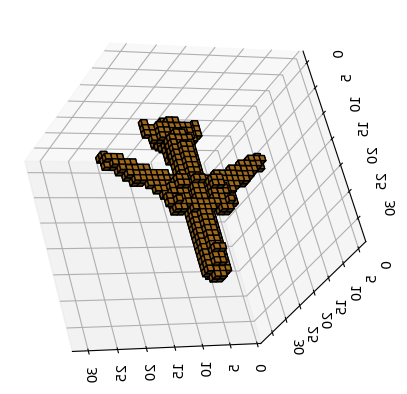
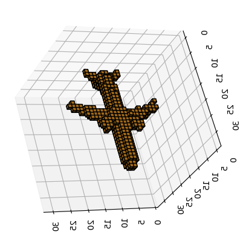

# Pix2Vox VAE: 3D Object Reconstruction with Variational Autoencoder

This project is a reimplementation and modification of the paper "Pix2Vox: Multi-scale Context-aware 3D Object Reconstruction from Single and Multiple Images" with a significant change to the encoder-decoder architecture, transforming it into a Variational Autoencoder (VAE).

<p align="center">

<br><br>
</p>

## Overview

This project presents a significant advancement in 3D object reconstruction by combining the strengths of Pix2Vox and variational autoencoders (VAEs). Pix2Vox is a state-of-the-art method for reconstructing 3D objects from single or multiple images, known for its ability to capture multi-scale context. VAEs, on the other hand, are generative models that can learn a latent representation of data, enabling tasks like generation and interpolation.

Our implementation builds upon the original Pix2Vox architecture, introducing a VAE-based encoder-decoder structure. This modification allows the model to learn a latent representation of the input images, which is then used to generate the 3D object. By leveraging the multi-scale context-aware approach of Pix2Vox, our model can capture fine-grained details and reconstruct complex 3D objects accurately.


## Key Features

- VAE-based encoder-decoder architecture for 3D object reconstruction
- Multi-scale context-aware approach from the original Pix2Vox
- Generative capabilities to enable creation of novel 3D objects


## Installation

```bash
# Clone the repository
git clone https://github.com/maniaa1822/pix2vox-vae.git
cd pix2vox-vae

# Install dependencies
pip install -r requirements.txt
```

```bash
# Update settings in config.py
__C.DATASETS.SHAPENET.RENDERING_PATH   = '/path/to/Datasets/ShapeNet/ShapeNetRendering/%s/%s/rendering/%02d.png'
__C.DATASETS.SHAPENET.VOXEL_PATH       = '/path/to/Datasets/ShapeNet/ShapeNetVox32/%s/%s/model.binvox'
```

## Usage

```bash
# To train the model
python3 runner.py
```

```bash
# To test the model
python3 runner.py --test --weights=/path/to/pretrained/model.pth
```

## Model Architecture

Our implementation differs significantly from the original Pix2Vox by incorporating a Variational Autoencoder (VAE) architecture. This modification allows for more robust and generative 3D reconstructions. Here's a detailed breakdown of our model:

### 1. Encoder

The encoder is based on a modified VGG16 with batch normalization (VGG16_bn), designed to process multi-view 2D images and extract meaningful features.

- **Feature Extraction**:
  - Base: Pre-trained VGG16 with batch normalization (first 27 layers)
  - Additional layers:
    - Conv2D → BatchNorm → ELU
    - Conv2D → BatchNorm → ELU → MaxPool
    - Conv2D (1x1) → BatchNorm → ELU
- **Latent Space Projection**:
  - fc_mu: Produces mean (μ)
  - fc_log_sigma: Produces log standard deviation (log σ)
- **Reparameterization**: Samples latent vector z using μ and σ

**Outputs**: μ (mean), log σ (log standard deviation), z (sampled latent vector)

### 2. Decoder

The decoder reconstructs 3D volumes from the latent representation.

- **Initial Transformation**:
  - Fully connected layer: Transforms z to 2048 * 2 * 2 * 2 dimensions
  - Reshaped to [batch_size, 2048, 2, 2, 2]
- **3D Deconvolution Layers**:
  1. ConvTranspose3d(2048 → 512) → BatchNorm3d → ReLU
  2. ConvTranspose3d(512 → 128) → BatchNorm3d → ReLU
  3. ConvTranspose3d(128 → 32) → BatchNorm3d → ReLU
  4. ConvTranspose3d(32 → 8) → BatchNorm3d → ReLU
  5. ConvTranspose3d(8 → 1) → Sigmoid

**Outputs**:
- raw_features
- gen_volumes (Final reconstructed 3D volumes)

### 3. Latent Space

The latent space is a crucial component of our VAE architecture, enabling the generation of diverse and realistic 3D reconstructions.

- **Encoding Process**:
  - Encoder projects input to μ and log(σ) for each latent dimension
- **Sampling**:
  - z = μ + ε * exp(log(σ)), where ε ~ N(0, 1)
  - Allows backpropagation through random sampling (reparameterization trick)
- **Decoding Process**:
  - Sampled z is transformed to initial 3D shape (2048 * 2 * 2 * 2)
  - Subsequent layers reconstruct full 3D object representation
- **Training Objectives**:
  - Reconstruction loss: Ensures decoded output matches input
  - KL divergence loss: Regularizes latent space to approximate N(0, I)


## Results

Our implementation of Pix2Vox with a VAE architecture has shown promising results in 3D object reconstruction. The journey to these results involved extensive experimentation and optimization, particularly given the challenges of working with large datasets on limited hardware.

### Training Details

- Epochs: 150
- Learning Rate: Implemented with a scheduler for optimal convergence
- Hardware: [Specify your hardware setup, e.g., GPU model and memory]

### Performance Metrics

We evaluated our model on three key object categories: aeroplanes, cars, and chairs. The following table presents our results, showing scores at various thresholds (t):

| Taxonomy  | #Sample | Baseline | t=0.20 | t=0.30 | t=0.40 | t=0.50 |
|-----------|---------|----------|--------|--------|--------|--------|
| aeroplane | 810     | 0.5130   | 0.5367 | 0.5614 | 0.5619 | 0.5441 |
| car       | 1501    | 0.7980   | 0.8210 | 0.8333 | 0.8348 | 0.8284 |
| chair     | 1357    | 0.4660   | 0.5035 | 0.5094 | 0.4960 | 0.4678 |
| Overall   |         |          | 0.6407 | 0.6534 | 0.6492 | 0.6322 |

#### Understanding the Voxelization Threshold (t)

The voxelization threshold 't' is a crucial parameter in interpreting our model's output. Here's how it works:

- Our model outputs a 3D matrix of floating-point numbers between 0 and 1, representing the probability of each voxel being occupied.
- The threshold 't' is used to convert these probabilities into a binary representation (occupied or not occupied).
- For example, if a voxel has a probability of 0.35:
  - At t = 0.3, this voxel would be considered occupied (since 0.35 > 0.3)
  - At t = 0.4, this voxel would not be considered occupied (since 0.35 < 0.4)
- Lower thresholds generally result in more voxels being considered occupied, potentially capturing more details but also increasing the risk of noise.
- Higher thresholds lead to sparser reconstructions, potentially missing some details but reducing noise.

By providing results at multiple thresholds, we offer a comprehensive view of our model's performance across different levels of reconstruction density.

### Visual Results

<table align="center">
  <tr>
    <td></td>
    <td></td>
  </tr>
</table>

*Figure 1: Example reconstruction for aeroplane.*

### Discussion

Our VAE-based implementation shows consistent improvements over the baseline model, particularly at thresholds *t* between 0.30 and 0.40. 

It's worth noting that these results were achieved through extensive experimentation with various hyperparameters and model configurations. 

The use of a learning rate scheduler proved crucial in managing the complex training dynamics of the VAE, allowing for better convergence over the 150 epoch training period.

Future work could focus on further optimizing the VAE architecture, exploring different latent space configurations, and potentially incorporating additional context information to improve performance on more complex object categories.


## Citation


```
@inproceedings{xie2020pix2vox++,
  title={Pix2Vox++: Multi-scale Context-aware 3D Object Reconstruction from Single and Multiple Images},
  author={Xie, Haozhe and Yao, Hongxun and Sun, Xiaoshuai and Zhou, Shangchen and Zhang, Shengping},
  booktitle={International Journal of Computer Vision},
  year={2020}
}
```
